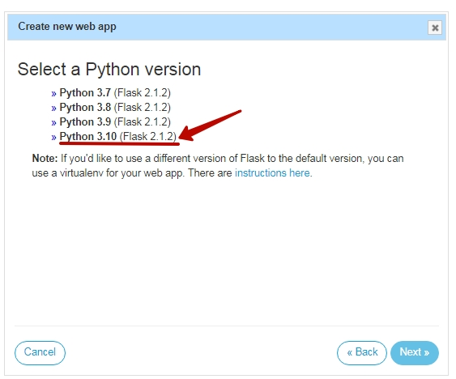
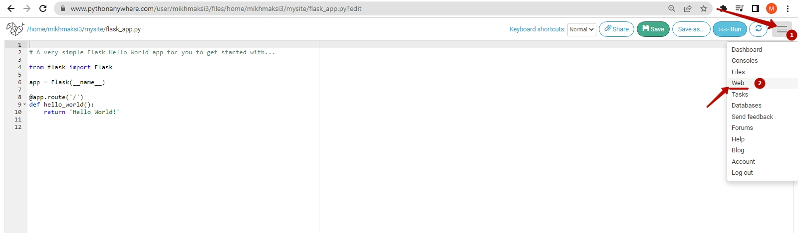
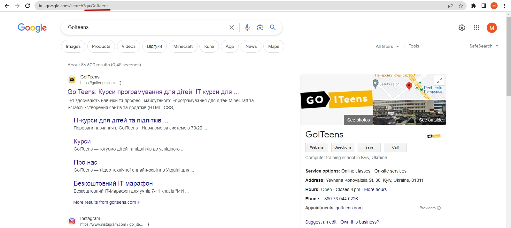
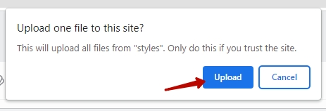

# advanced-program-probe
Ми сьогодні з вами розберемося із тими технологіями, які вивчаються в Advanced Program.
	За результатом проходження даної програми студенти отримують кваліфікацію, яку можна описати як FullStack Python Development - це спеціаліст, який  може створити інтерфейс, а також створити серверну частину до цього інтерфейсу.
	На цьому занятті ми з вами створимо Інтернет-застосунок, який дозволяє проходити тести.
Для цього ми спочатку створимо серверний додаток на Python, а далі - підключемо до нього вже створений інтерфейс.

## Реєструємося на Pythonanywhere
[Pythonanywhere](https://www.pythonanywhere.com/registration/register/beginner/)  
  
Після реєстрації - ми попадемо на головну сторінку сервісу **Pythonanywhere**  

Далі - нам необхідно встановити бібліотеки, що нам вони знадобляться для запуску нашого серверного додатку.  
Для цього натиснемо кнопку **"Bash"**  
  
Відкривається консоль, в якій ми можемо встановити бібліотеку flask, написавши:  
**pip install flask**  

А також бібліотеку flask_cors, написавши:  
**pip install flask_cors**

  
Далі - повернемося до головної сторінки сервісу:  
  
Та перейдемо на сторінку створення та управління **Web-додатками**
  
Та створимо новий Web-додаток  
  
Погодимся із стандартним ім'ям додатку (яке буде співпадати із ім'ям нашого логіну)  
  
Оберемо Flask, як бібліотеку для створення Web-додатку.  
  
Оберемо Python версії 3.10  
  
Залишимо ім'я створюваного файлу за замовчуванням  
  
В результаті - отримаємо створений додаток, відкрити який можна за посиланням, що відображається в вашому обліковому запису:  
  
Відкривати краще в новій вкладці:  
  
У вкладці, що відкриємться побачимо, що наш додаток працює із функціоналом за замовчуванням:
  

## Зміна вихідного коду.
Для того, щоб змінити вихідний код на той, що нам потрібер - 
  
Переходимо до папки "mysite":  
  
Та відкриваємо файл "flask_app.py"  
  
Ми бачимо рядок, який відоповідає за вивід тексту "Hello from Flask!"  
  
Давайте змінимо його на "Hello World!" та збережемо зміни  
  
Повернемося на розділ керування Web-додатком:  
  
Оновимо додаток, та відкриємо посиалння ще раз:  
  
Побачимо, що текст дійсно змінився:
  

## Досвід програмування.
Далі ми з вами попрацюємо над тим, що зрозуміємо наш серверний додаток.
Візьмемо код, який додає [ендпоінт](https://github.com/mikh-maksi/advanced-program-probe/blob/main/code/python/flask02.py).
  
Вставимо його як вихідний код  
  
Повернемося на сторінку Web-додатків  
  
Оновимо додаток та вікриємо сторінку  
  
Побачимо, що відпрацьовує новий ендпоінт
  

> Тепер ви вмієте створювати ендпоінт, який воводить текст на екран!

> Але як ось цьом серверному додатку щось розказати? 
Для цього використовуються методи відправки даних. Вони використовуються в тому  числі, коли ви авторизуєтеся на сайтах, або, наприклад, даний запит виконує пошук в Google за запитом GoITeens https://www.google.com/search?q=GoIteens 
  
Ми також можемо навчити наш серверний додаток розуміти те, що ми йому кажемо. Для цього - додамо бібліотеку request та відповідній функції на ендпоінт /calc скажемо "слухати" всі дані, які приходять як запити.
Скоріюємо нові елементи:
  
Вставимо елементи в код:  
Додамо елемент підключення бібліотеки:

> from flask import request

  

> @app.route("/calc",methods=['GET'])  
def calc():  
    if request.method == "GET":  
        if request.args.get('n') == None:  
            n = 0  
        else:  
            n = int(request.args.get('n'))  
    return str(n)  
  

Повернемося на сторінку Web-додатків  
  
Оновимо додаток та вікриємо сторінку  
  

Побачимо, що в залежності від параметру змінюється відображення:
  

Далі - давайте навчимо цю програму рахувати. Тепер - будемо слухати не значення параметра n, а значення параметрів a та b
Візьмемо [нову реалізацію](https://github.com/mikh-maksi/advanced-program-probe/blob/main/code/python/flask04.py) функції calc.
  
Змінимо вихідні файли:  

  

Та відкриємо Web-додаток  
  
І побачимо, що ми можемо отримувати параметри та вони відображаються в тексті
  

> Ми навчилися передавати нашому серверному додатку параметри, робити із ними обрахунки і видавати результат.

## Вивід питань
Додамо [функцію, яка виводить питання](https://github.com/mikh-maksi/advanced-program-probe/blob/main/code/python/flask05.py)  

  
Вставимо функцію до загального файла  
  

Оновимо додаток та вікриємо сторінку  
  

Побачимо, що можемо змінювати текст, змінюючи параметри:  
  

### Додаткове завдання
Можемо додати питання, яке обере саме студент

Візьмемо [підсумковий код файлу](https://github.com/mikh-maksi/advanced-program-probe/blob/main/code/python/flask07.py)  

  

Повністю замінемо вихідний код:  
  

Оновимо додаток та вікриємо сторінку  
  
Побачимо технічний вивід - у форматі JSON  
  

## Створення FrontEnd
В сервісі https://replit.com/ створимо новий проект  
  

Оберемо тип проекту **HTML,CSS,JS**
  
Видалимо файли за замовчуванням:  
  
  

Скачаємо [файли проекту](https://github.com/mikh-maksi/ap-probe-fe):  
  
Розпакуємо скачаний архів:  
  
  
Повернемося в Replit  
  
  

  

  

  

  
  

  

  

  

  
  
  
  
  
  

