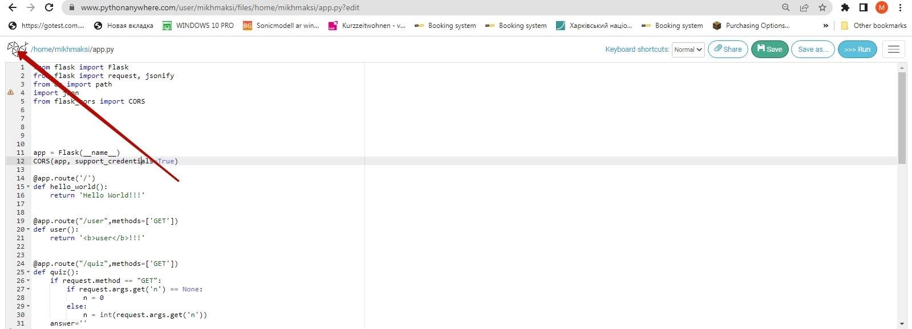
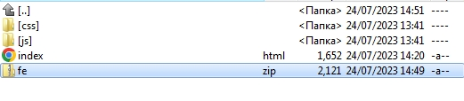

# advanced-program-probe
## Реєструємося на Pythonanywhere
[Pythonanywhere](https://www.pythonanywhere.com/)  
  
  
  
  
  
  
  
  
  
  
  
  
  
  
  
  
  
  
  
  
  
  
  
  
  
  
  

## Робимо FrontEnd-частину
[Скачаємо файли FE-частини](https://github.com/mikh-maksi/ap-probe-fe)  

  
  
  
  
  
  
  
  
  
  
  
  
  
  
  
  
  

# Вихідний код:
[Вихідний код](https://github.com/mikh-maksi/advanced-program-probe/tree/main/code)